# JOBIFY
JOBIFY is a platform that provides a comprehensive range of features designed to assist job seekers in their search for employment. With a user-friendly interface and personalized job recommendations, JOBIFY aims to make the job search experience efficient, effective, and enjoyable. 

  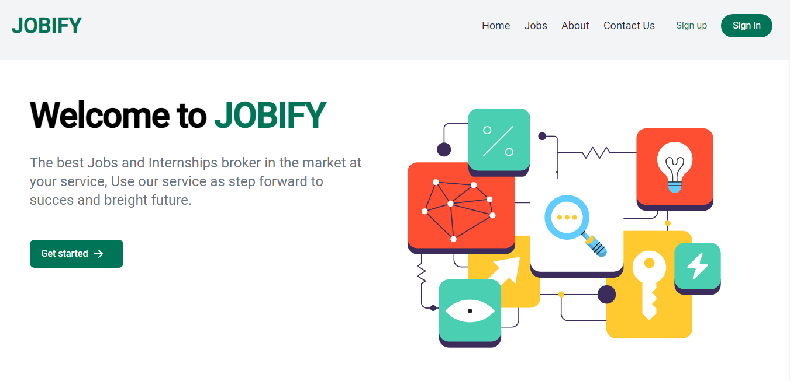

## Table of Contents

* [JOBIFY](#JOBIFY)
* [Table of Contents](#table-of-contents)
* [Data Modeling and Design](#data-modeling-and-design)
* [Features](#features)
* [Technologies Used](#technologies-used)
* [Home Page](#home-page)
* [Sign up Page](#sign-up-page)
* [About Page](#about-page)
* [Contact Page](#contact-page)
* [Jobs Page](#jobs-page)
* [Apply Page](#apply-page)
* [Dashboard](#dashboard)
    * [User Management](#user-management)
    * [User Submissions](#user-submissions)
* [Conclusion](#conclusion)

## Data Modeling and Design

  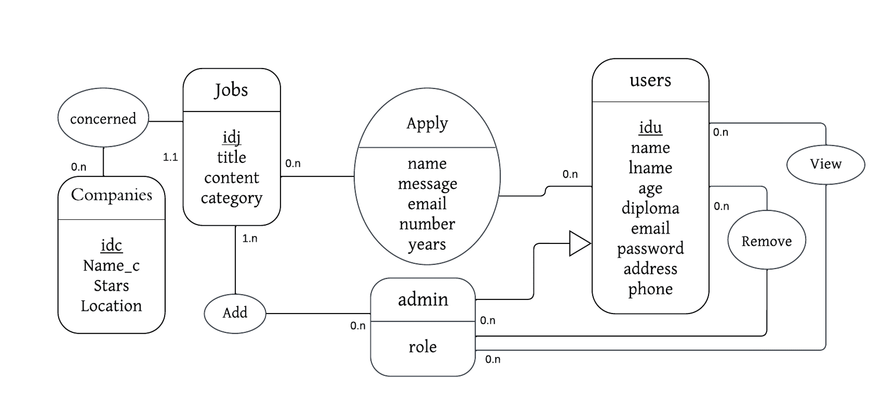

## Features

* Comprehensive range of features for efficient job search
* User-friendly interface with personalized job recommendations
* Bridge between job seekers and employers, benefiting both parties
* Access to diverse job opportunities in various sectors
* Tailored opportunities for full-time, part-time, freelance, and remote positions
* Intuitive search interface with refined results
* Seamless application process for convenience
* Constant evolution and enhancement for a rewarding experience

## Technologies Used

  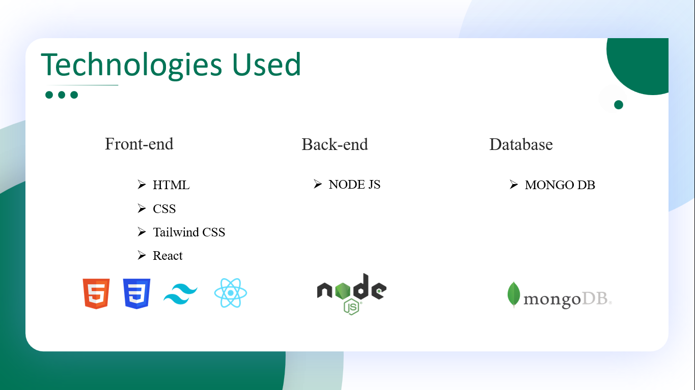

## Home Page

The Home Page of our platform welcomes you with a vibrant and engaging design, aimed at providing a seamless user experience. Divided into three sections, it ensures that you have all the necessary information at your fingertips to embark on a successful career journey.

  

At the top of the Home Page, you will find our distinctive header. It features a captivating image that showcases the diverse and exciting world of job opportunities. Accompanying the image is a powerful message: "The best Jobs and Internships broker in the market at your service." This statement reflects our commitment to serving as your trusted partner, helping you navigate the job market and secure a bright future. With our platform, you can take the first step towards success. Directly below the header, you will encounter our Services Section, where we highlight the key offerings of our platform.

  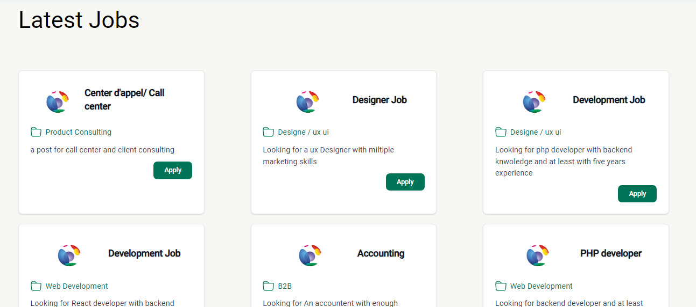

Moving further down the Home Page, you will discover our Latest Jobs and Company Posts Section. Here, we showcase the most recent job openings and company updates, allowing you to stay up-to-date with the latest opportunities. Each listing provides a direct link that takes you to the respective application page, enabling you to apply seamlessly with just a few clicks.

## Login Page

Our Login Page offers a streamlined and secure way for users to access their accounts. With a user-friendly interface and essential features, we aim to provide a hassle-free experience for both new and returning users.

  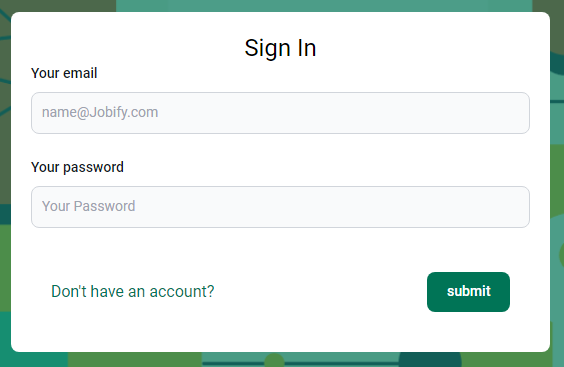

A concise form is provided, allowing users to enter their login credentials. The form prompts users to input their email address and password to securely access their account. The "Your email" field is where users should enter the email address associated with their account. This ensures accurate identification and personalized access. The "Your password" field prompts users to enter their account password, ensuring only authorized individuals can access the account and protecting user data and privacy. Password characters are masked for security purposes.

At the bottom of the form, a prominent "Submit" button is placed. Clicking "Submit" initiates the login process.

  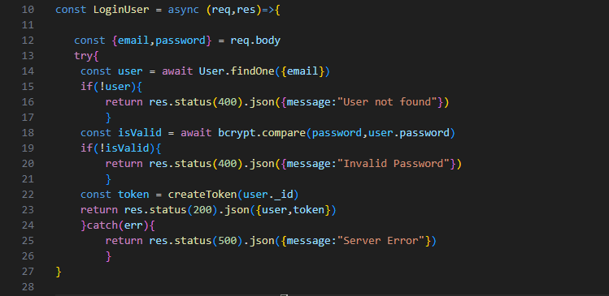

After submitting, the platform checks if the provided email exists in the database using the function findOne({email}). If the email exists, the platform compares the provided password with the password stored in the database using the function compare(password, user.password) This ensures a secure and accurate login process.

## Sign up Page
Our Sign-Up Page offers a user-friendly and secure platform for individuals to create their accounts and unlock the full range of features and services available on our platform. With a carefully designed interface and essential input fields, we aim to provide a seamless and efficient registration experience for new users.

  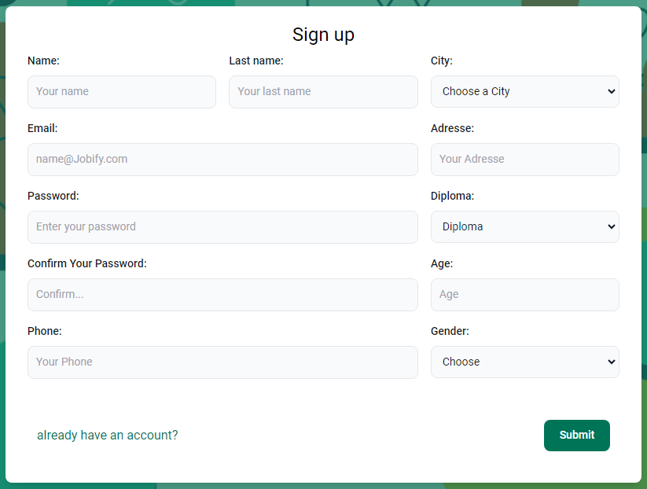

As you arrive at the Sign-Up Page, you'll notice a prominent heading that says "Sign up," indicating the purpose of the page and guiding users towards creating their accounts. Below the heading, you'll find a series of input fields labeled to prompt users for specific information. They can enter their first name, last name, select their city, provide a valid email address, residential address, choose a secure password, confirm it, select their highest educational qualification, enter their age, phone number, and select their gender from a list of options. These inputs enable us to personalize their experience, provide relevant job opportunities, and ensure effective communication.

inally, a prominent "Submit" button is displayed, indicating that users have completed the necessary input fields and are ready to proceed.

  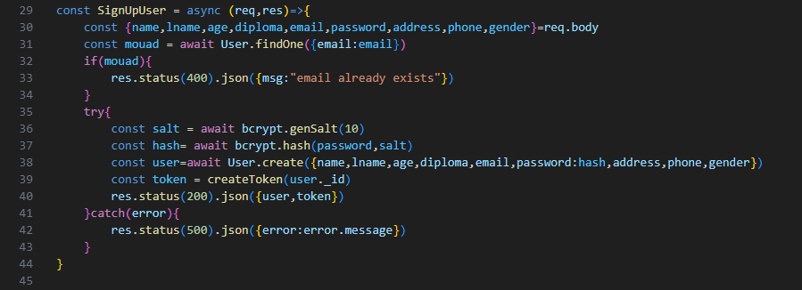

Upon submission, the backend processes the information provided by the user. This includes checking if the email already exists in the database using the function findOne({email: email}). If the email is already registered, an appropriate error message is returned. Otherwise, the password is securely hashed using a salt and bcrypt, and the user's account is created in the database.

## About Page

The About Page provides a comprehensive overview of our platform, highlighting its key features and the benefits it offers to both job seekers and employers. Through a well-crafted interface and innovative functionalities, we aim to transform the job search process and facilitate meaningful connections in the professional world.

  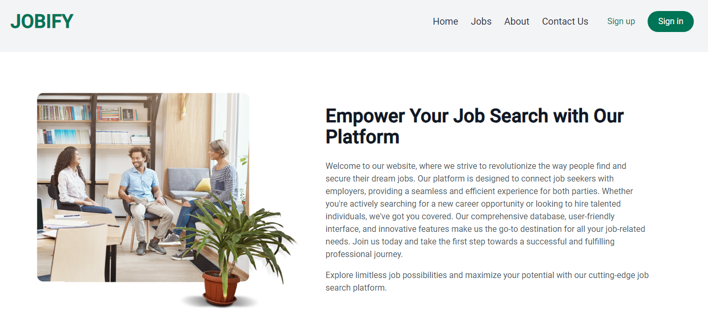

## Contact Page

The Contact Page serves as a convenient communication channel for various inquiries. If there are any technical issues experienced while using our platform, users are encouraged to contact us via email. The support team promptly addresses concerns and provides necessary assistance to ensure a seamless experience.

  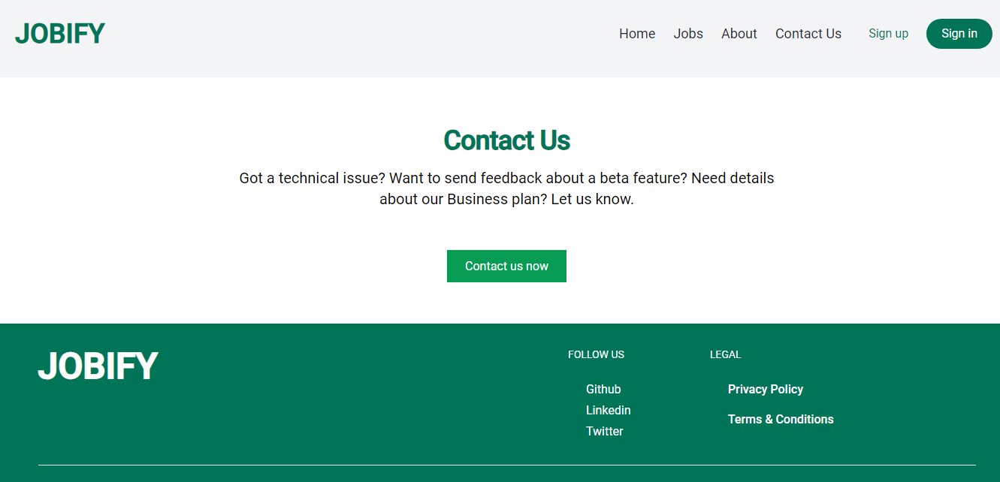

## Jobs Page

The Jobs Page on our platform serves as a centralized hub where users can discover and apply for various job opportunities. This page features a comprehensive list of available jobs, each accompanied by essential details to aid users in their decision-making process.

  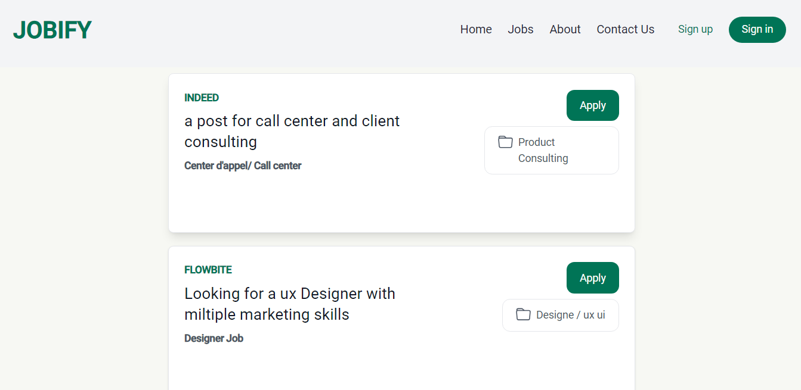

Upon reaching the Jobs Page, visitors will find a well-organized layout with a user-friendly interface. At the top of the page, a convenient navigation bar offers easy access to different sections of our platform, ensuring a seamless browsing experience. Additionally, a footer containing essential links is available for quick reference. As users scroll down the page, they will come across a diverse range of job listings. Each listing includes key information such as the company name, a description of the job post, the job title, and the type of position. This clear categorization allows users to quickly identify and focus on job opportunities that align with their skills and interests.

When users find a job listing that piques their interest, they can simply click on the "Apply" button associated with that specific job. This action redirects them to a dedicated application page where they can further explore the job requirements and complete the application process. Our platform is designed to facilitate a seamless and efficient application experience, ensuring that users have all the necessary features at their disposal.

## Apply Page

After users have selected a job from the Jobs Page and clicked the "Apply" button, they will be redirected to our Apply Page. This page represents a pivotal component of our platform, embodying professionalism and efficiency in the application process. This section provides applicants with a seamless and sophisticated experience as they submit their applications.

  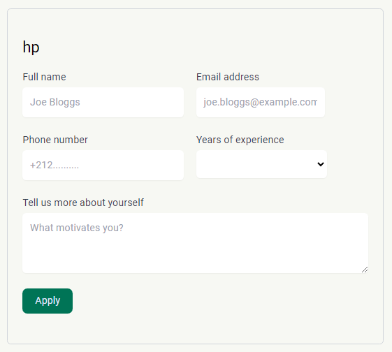

Comprising a user-friendly form, the Apply Page empowers applicants to effortlessly enter their information and express their interest in a desired position. With fields such as Full Name, Email Address, Phone Number, and Years of Experience, the form captures essential details necessary for effective communication and evaluation of applicants' qualifications.

The Apply Page ensures clear and user-friendly navigation with thoughtfully labeled and well-organized fields. Applicants provide their Full Name for personalized representation and accurate identification. The Email Address field facilitates seamless communication, enabling timely updates on application status. Additionally, the Phone Number field offers an extra contact option for further discussions. The Years of Experience field plays a crucial role in assessing applicants' expertise, allowing potential employers to make informed decisions. The open-ended section, "Tell us more about yourself," encourages applicants to showcase their skills, qualifications, and achievements, leaving a strong impression. Upon completing the form, applicants demonstrate their interest by clicking the "Apply" button, officially submitting their application and expressing their commitment to the opportunity.

## Dashboard

For Administrator the platform provides an exclusive space to manage and oversee various aspects of the system. This page is specifically designed to cater to the unique needs and responsibilities of administrators.

  

For administrators, accessing the Dashboard is made simple through this dedicated link in the navigation bar. This link is specifically designed to be accessible only to administrators, ensuring that they have exclusive access to the administrative functionalities and features offered by the platform.

Once administrators access the Dashboard, they are presented with a comprehensive set of tools and options to manage the system effectively. From this centralized hub, administrators can perform a range of administrative tasks

## User Management
Within the Dashboard, administrators have the primary function of overseeing and managing user accounts. They are provided with the capability to view all registered users within the platform, allowing them to have a comprehensive overview of the user base. Administrators can access a list of users, including their profiles and associated information. In addition to user visibility, administrators also have the authority to remove user accounts when necessary. By removing accounts that violate platform policies or exhibit suspicious or inappropriate behavior., administrators maintain the platform's integrity, security, and user experience.

  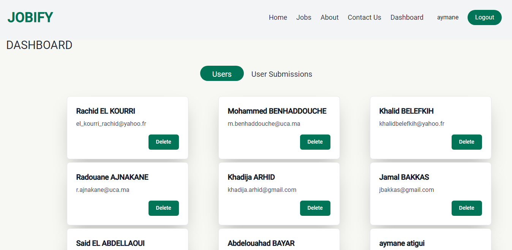

The ability to see and remove users provides administrators with an essential tool for user management and maintaining a healthy and reliable user community within the platform. With this function, administrators can effectively monitor user activity and take prompt actions to address any issues, ensuring a safe and positive user experience for all platform users.

## User Submissions

Another important feature available to administrators in the Dashboard is the ability to manage user submissions for jobs. The platform provides administrators with a dedicated section where they can oversee and review all job submissions made by users. This function allows administrators to have a clear overview of the companies and individuals who have submitted applications.

  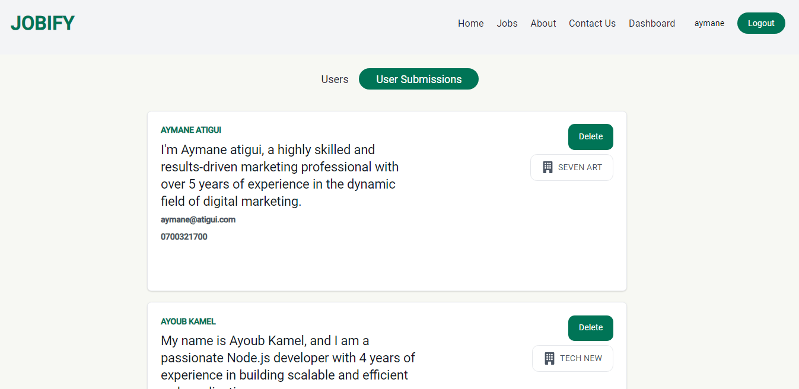

Within this section, administrators can access details such as the name of the submitting company, the name of the individual who submitted the application, a description provided by the applicant, as well as their email address and phone number. This comprehensive information allows administrators to effectively review and evaluate the job submissions. Moreover, administrators have the authority to delete any inappropriate or irrelevant submissions to maintain the quality and relevance of the job listings. This control ensures that only valid and suitable submissions are displayed, providing a reliable and efficient job application process for both companies and job seekers

## Conclusion

In conclusion, JOBIFY is a transformative job search platform that provides a comprehensive range of features to assist job seekers in finding meaningful employment. With its user-friendly interface, personalized job recommendations, and seamless application process, JOBIFY aims to make the job search experience efficient and enjoyable. The platform's constant evolution and commitment to excellence empower job seekers to discover diverse opportunities and enable employers to connect with top talent. JOBIFY is a valuable resource that bridges the gap between job seekers and employers, revolutionizing the way people find and secure employment.
